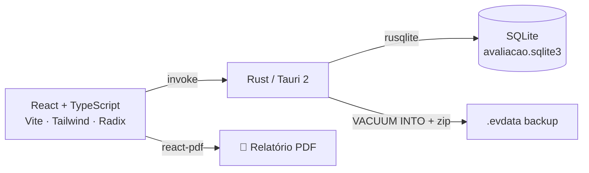

<div align="center">

# 🏋️ Personal

**Gestão de alunos e avaliações físicas para personal trainers**

Um app desktop (macOS/Windows) que substitui a velha planilha + Word: cadastre alunos,
registre avaliações completas, compare fotos e medidas lado a lado e gere o relatório
em PDF pronto para enviar no WhatsApp.


</div>

---

## 📖 Sobre

O **Personal** centraliza todo o fluxo de acompanhamento de alunos de uma academia/
consultoria: cadastro, avaliações físicas periódicas, comparação visual de fotos,
evolução de medidas e controle de pagamentos.

- 🗄️ **Totalmente offline** — banco de dados SQLite embarcado no aplicativo, sem login,
  sem servidor, sem internet.
- 🇧🇷 **Interface em português (BR)**.
- 📱 **Layout responsivo** pensado para uma futura versão mobile (Tauri Mobile), embora
  o foco atual seja desktop.
- 📄 **Relatório em PDF** com tabelas comparativas, comparativo de fotos e gráficos de
  evolução.

---

## ✨ Funcionalidades

### 👥 Alunos
- Cadastro completo: nome, telefone, data de nascimento, gênero, dia de vencimento e
  observações.
- Foto de perfil **opcional** (com avatar padrão quando não há foto).
- Busca por nome e modos de ordenação:
  | Modo | Ordena por |
  | --- | --- |
  | **Nome** | Alfabética |
  | **Vencimento** | Não pagos primeiro, depois por data de vencimento |
  | **Próxima Avaliação** | Data prevista da próxima avaliação (mais próxima primeiro) |
  | **Data de Nascimento** | Próximo aniversário (mais próximo primeiro) |
- Ativar/desativar alunos (mantém o histórico sem poluir a lista).
- Exportação da lista de alunos em PDF.

### 📋 Avaliações
- Registro completo por avaliação: data, peso, altura, **medidas de perímetros** e
  **bioimpedância** (IMC, gordura corporal, massa muscular, TMB, idade metabólica, etc.).
- Numeração automática e sequencial (não editável).
- Aba **Dados Gerais** com a idade do aluno **na data da avaliação** (anos, meses e dias).
- Aba **Fotos** para comparar dois registros do **mesmo ângulo** lado a lado, com
  controles independentes para escolher qualquer combinação de avaliações.
- Edição, exclusão e seleção da avaliação exibida.

### 📸 Editor de fotos
- Recorte com proporção fixa, **zoom** e **arraste** para enquadrar.
- **Foto de referência**: sobrepõe (50% de transparência) uma foto de uma avaliação
  anterior para alinhar posição e tamanho entre avaliações. A referência é só um guia
  visual — nunca entra na imagem final salva.
- Fotos de referência organizadas por ângulo (Frontal, Lateral Direita, Lateral
  Esquerda, Costas).

### 📈 Evolução
- Gráficos de linha (Recharts) de todas as medidas ao longo do histórico.
- Tooltip com valor, unidade e **data da avaliação**.
- Filtro por métrica ou visualização de todas ao mesmo tempo.

### 💸 Pagamentos
- Dia de vencimento configurável **por aluno** (com ajuste automático para o último dia
  do mês, ex.: dia 31 em fevereiro → 28).
- Geração automática das mensalidades do **mês atual** e do **próximo**.
- Marcar/desmarcar como pago, com registro da data de pagamento.

### 📄 Relatório PDF
- Seleção das avaliações a comparar (por padrão, a **primeira** e as **duas últimas**).
- Tabelas comparativas com indicadores de tendência (↑ ↓ =):
  - **Dados Gerais** — Peso, Altura, **Idade** (anos, meses e dias, na data da avaliação)
    e observações;
  - **Medidas de Perímetros (cm)**;
  - **Medidas de Bioimpedância**.
- **Comparação de Fotos** em tamanho grande, duas por página, agrupadas por ângulo.
- **Evolução Completa** com gráficos das **últimas 15** avaliações.
- Índice com o histórico das últimas 15 avaliações.

### ⚙️ Configurações e backup
- Intervalo entre avaliações (em dias) usado para calcular a próxima avaliação.
- **Backup** em arquivo `.evdata` (snapshot consistente do banco) e **importação** para
  restaurar/substituir todos os dados.

---

## 🧱 Tecnologias

| Camada | Tecnologia |
| --- | --- |
| App desktop | [Tauri 2](https://tauri.app) |
| Interface | React 19 + TypeScript + Vite |
| Estilo | Tailwind CSS 4 + componentes no estilo shadcn/ui (Radix UI) |
| Estado / dados | TanStack Query v5 |
| Rotas | React Router v7 (HashRouter) |
| Formulários | react-hook-form + Zod |
| Gráficos | Recharts |
| PDF | `@react-pdf/renderer` |
| Backend | Rust + `rusqlite` (SQLite embarcado) |
| Ícones | lucide-react |

---

## 🏗️ Arquitetura

O front-end (webview) conversa com o back-end Rust por **comandos Tauri** tipados
(`invoke`), e o Rust é a única camada que toca o SQLite.



- Os comandos Tauri são definidos em `src-tauri/src/commands/` e implementados em
  `src-tauri/src/repo/` (acesso ao banco) com structs `serde` em `src-tauri/src/models/`.
- As fotos são armazenadas como **BLOB** no SQLite e trafegam como base64.
- As migrações SQL são aplicadas na inicialização do app e registradas na tabela
  `schema_migrations` (nunca edite uma migração já publicada — adicione uma nova).

---

## 🚀 Como rodar

### Pré-requisitos

- **Node.js 20+** (e npm)
- **Rust** (stable) + Cargo
- Dependências de sistema do Tauri para o seu SO (Xcode Command Line Tools no macOS,
  WebView2 no Windows, `webkit2gtk` no Linux) — veja a documentação em
  [tauri.app](https://tauri.app).

### Instalação e desenvolvimento

```bash
# instalar dependências do front-end
npm install

# rodar o app completo (Tauri + Vite) com hot reload
npm run tauri dev

# rodar apenas o front-end no navegador (http://localhost:1420)
npm run dev
```

### Build de produção

```bash
npm run tauri build
```

### Scripts úteis

| Comando | Descrição |
| --- | --- |
| `npm run dev` | Sobe apenas o Vite (front-end) |
| `npm run build` | Type-check (`tsc`) + build do front-end |
| `npm run tauri dev` | Executa o app desktop em modo desenvolvimento |
| `npm run tauri build` | Gera o executável/instalador do app |
| `cd src-tauri && cargo test` | Roda os testes unitários do back-end Rust |

---

## 📁 Estrutura do projeto

```
avaliacao/
├── src/                        # Front-end (React + TypeScript)
│   ├── components/
│   │   ├── evaluations/        # Aba Avaliações, formulário e detalhe
│   │   ├── evolution/          # Gráficos de evolução (Recharts)
│   │   ├── members/            # Lista e formulário de alunos
│   │   ├── payments/           # Aba Pagamentos
│   │   ├── pdf/                # Documentos e modais de PDF
│   │   ├── photos/             # Aba Fotos (comparação por ângulo)
│   │   ├── settings/           # Configurações e backup
│   │   ├── shared/             # Componentes reutilizáveis (editor de foto, etc.)
│   │   └── ui/                 # Componentes base (estilo shadcn/ui)
│   ├── lib/                    # Clientes Tauri, queries, schemas, métricas, datas
│   ├── pages/                  # Páginas (lista de alunos e detalhe do aluno)
│   └── types/                  # Tipos compartilhados
└── src-tauri/                  # Back-end (Rust)
    ├── src/commands/           # Comandos Tauri expostos ao front-end
    ├── src/repo/               # Acesso ao SQLite (CRUD, pagamentos, backup)
    ├── src/models/             # Structs serializáveis (serde)
    └── src/db/migrations/      # Migrações SQL versionadas
```

---

## 🗄️ Banco de dados

SQLite embarcado, sem servidor. O arquivo `avaliacao.sqlite3` fica no diretório de
dados do app (resolvido pelo Tauri em `app_data_dir`). Principais tabelas:

| Tabela | Conteúdo |
| --- | --- |
| `members` | Alunos (incl. foto de perfil, dia de vencimento e status ativo) |
| `evaluations` | Avaliações (peso, altura, perímetros, bioimpedância e 4 fotos) |
| `payments` | Mensalidades por aluno/mês |
| `settings` | Configurações globais (intervalo entre avaliações) |
| `schema_migrations` | Controle das migrações aplicadas |

---

## ✅ Testes

- **Rust**: testes unitários cobrindo CRUD, numeração de avaliações, ordenação da lista
  de alunos, cálculos de vencimento e ida/volta do backup.

  ```bash
  cd src-tauri && cargo test
  ```

- **Front-end**: verificação de tipos com `tsc` no `npm run build`.

---

## 🗺️ Roadmap

- [ ] Versão mobile (Android/iOS) via Tauri Mobile — a UI já é responsiva.
- [ ] Empacotamento assinado para distribuição (macOS/Windows).

---

## 📜 Licença

Distribuído sob a licença **MIT**. Veja o arquivo [`LICENSE`](./LICENSE) para mais detalhes.

---

<div align="center">

Desenvolvido por **[Gustavo Okuyama](https://github.com/gubtos)**.

</div>
